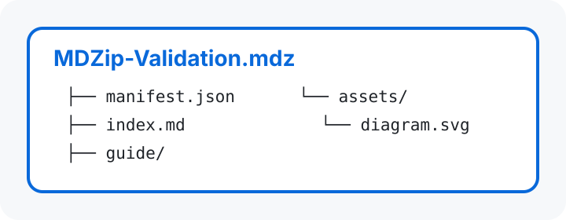

# MDZip動作確認

このページが最初に表示されれば、`manifest.json`の`entryPoint`が正しく読み込まれています。

## 内包画像

次の画像はMDZipアーカイブ内の`assets/diagram.svg`です。

## GFM表示

| 確認項目 | 期待結果 |
| :--- | :--- |
| manifest | このページが最初に表示される |
| image | 上の構成図が表示される |
| navigation | ツールバーに3つのMarkdownが表示される |

- [x] MDZipを開けた
- [ ] 詳細ページを確認する

## ページ移動

- [詳細ページを開く](guide/details.md)
- [Mermaidページを開く](guide/mermaid.md)
