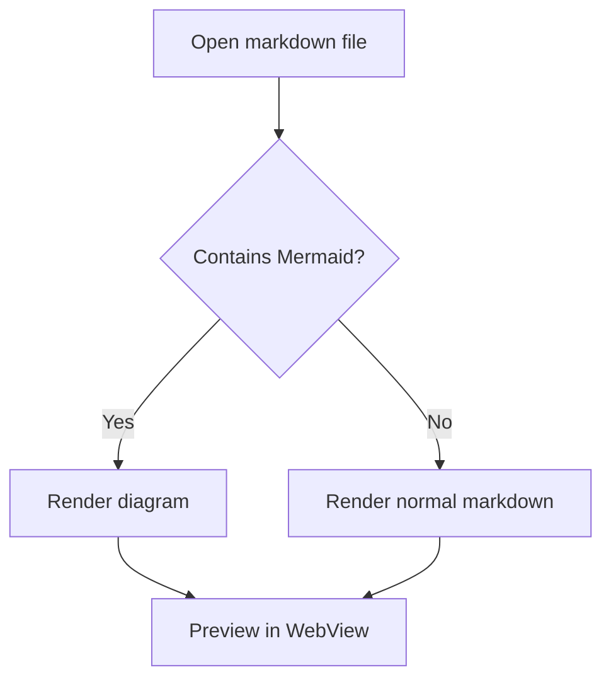
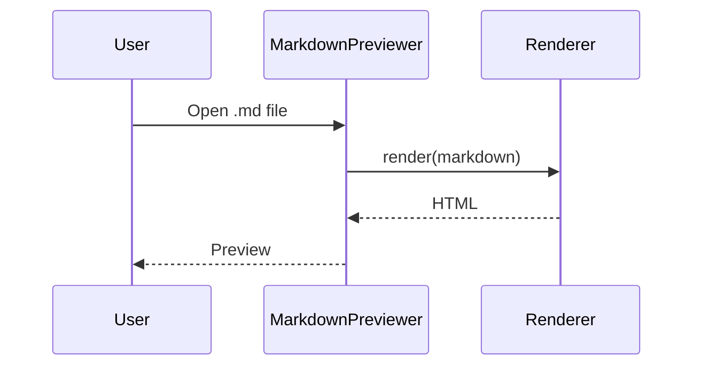
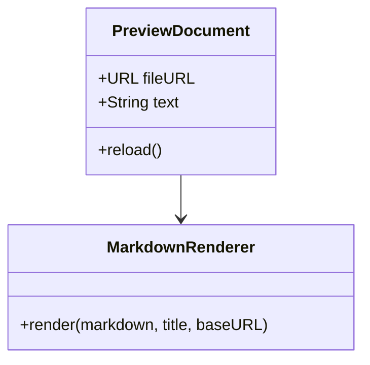
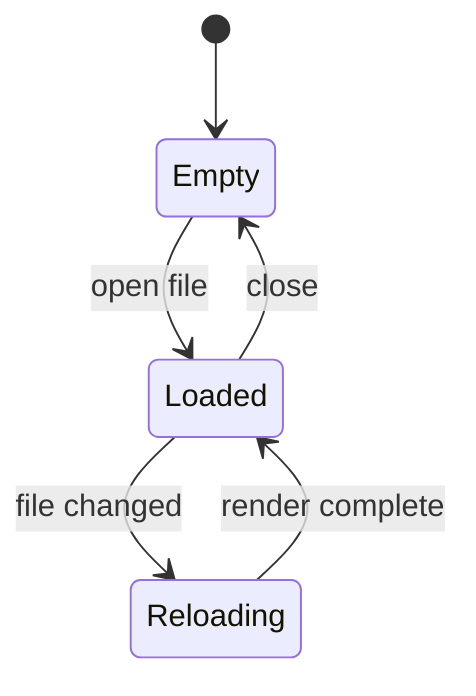
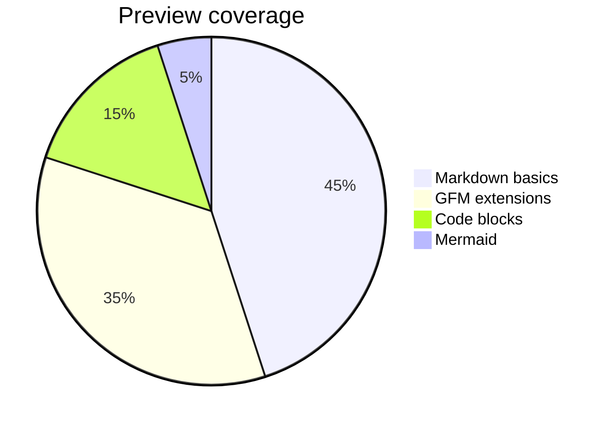

# Mermaid Preview Cases

This file is for checking how Mermaid fenced blocks are displayed in the previewer.
If Mermaid rendering is added later, each block should become a diagram instead of a highlighted code block.

## Flowchart

## Sequence Diagram

## Class Diagram

## State Diagram

## Pie Chart

